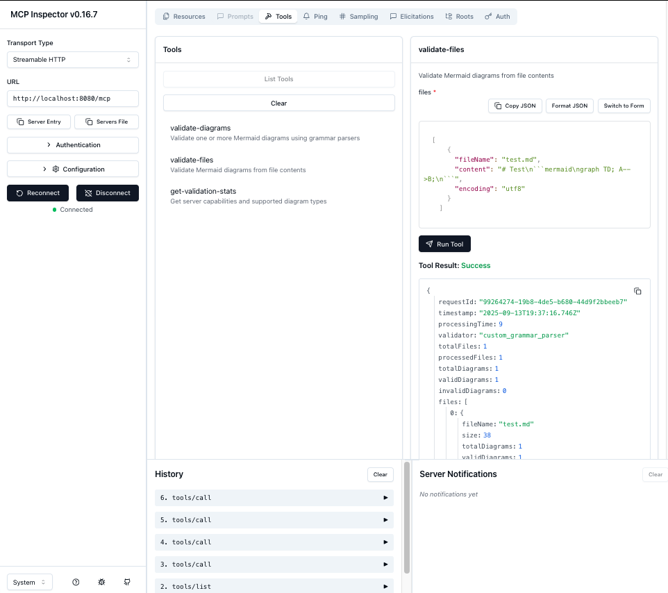

# Mermaid Validator API

[](./LICENSE)
[](https://www.npmjs.com/package/@ai-of-mine/fast-mermaid-validator-mcp)
[](https://nodejs.org/)
[](./Dockerfile)
[](./CONTRIBUTING.md)

High-performance API and **Model Context Protocol (MCP) server** for validating Mermaid diagrams with comprehensive security features, multiple transport options, and enterprise-grade capabilities.

**Author**: Gregorio Elias Roecker Momm (gregoriomomm@gmail.com)

## 🆕 **Latest Updates**

**Unified CLI with Port Configuration:**
- ✅ **Single Command**: One `npx` command with flags to start any server mode
- ✅ **Port Control**: `--port <number>` flag works with all server modes
- ✅ **Environment Variables**: `PORT`, `MCP_HTTP_PORT`, `MCP_HTTP_HOST` support
- ✅ **REST API**: `npx @ai-of-mine/fast-mermaid-validator-mcp` (default port: 8000)
- ✅ **MCP HTTP**: `npx @ai-of-mine/fast-mermaid-validator-mcp --mcp-http` (default port: 8080)
- ✅ **Built-in Help**: `npx @ai-of-mine/fast-mermaid-validator-mcp --help`

**Package Features:**
- ✅ **NPM Package**: Available as `@ai-of-mine/fast-mermaid-validator-mcp`
- ✅ **Security Updates**: Fixed multer vulnerabilities
- ✅ **Clean Logging**: Default log level set to `warn` for production readiness
- ✅ **Complete Distribution**: Both source (`src/`) and compiled (`dist/mcp/`) files
- ✅ **Enterprise Ready**: Unlimited configuration, environment variables, Docker support

**API Endpoints:**
- `http://localhost:8000/api/v1/validate` - Direct diagram validation (JSON)
- `http://localhost:8000/api/v1/upload/file` - File upload validation (multipart)

**MCP Server Commands:**
- `npx @ai-of-mine/fast-mermaid-validator-mcp --mcp-stdio` - Stdio transport (Claude Desktop)
- `npx @ai-of-mine/fast-mermaid-validator-mcp --mcp-http` - HTTP transport (port 8080)
- `npx @ai-of-mine/fast-mermaid-validator-mcp --mcp-secure` - Secure HTTP with authentication

## 🚀 **Dual Architecture: REST API + MCP Server**

This project provides **two complementary interfaces**:

1. **🌐 REST API**: Traditional HTTP API for web applications and direct integrations
2. **🤖 MCP Server**: Model Context Protocol server for LLM integrations (Claude Desktop, etc.)

### **Quick Start**

```bash
# Install from npm (recommended)
npm install @ai-of-mine/fast-mermaid-validator-mcp

# Start REST API server (default)
npx @ai-of-mine/fast-mermaid-validator-mcp

# Start MCP HTTP server
npx @ai-of-mine/fast-mermaid-validator-mcp --mcp-http

# Start MCP stdio server
npx @ai-of-mine/fast-mermaid-validator-mcp --mcp-stdio

# Start MCP secure server
npx @ai-of-mine/fast-mermaid-validator-mcp --mcp-secure

# Show help
npx @ai-of-mine/fast-mermaid-validator-mcp --help
```

**Alternative: Install from source**
```bash
git clone https://github.com/ai-of-mine/fast-mermaid-validator-mcp.git
cd mermaid-validator-mcp
npm install
npm run build:mcp

# Use npm scripts
npm start              # REST API server
npm run start:mcp      # MCP stdio
npm run start:mcp-http # MCP HTTP
npm run start:mcp-secure # MCP secure
```

**Test MCP HTTP server:**
```bash
npx @modelcontextprotocol/inspector http://localhost:8080/mcp
```

## 🎯 **Core Features**

### **Validation Capabilities**
- **28 Mermaid Diagram Types**: Complete support with real grammar parsing
- **Multi-format Support**: Markdown files, ZIP archives, direct input
- **Real Grammar Validation**: Jison, ANTLR, and Langium parsers
- **High Performance**: Optimized with minimal dependencies

### **MCP Server Features**
- **Multiple Transports**: Stdio, HTTP streamable, Server-Sent Events (SSE)
- **3 MCP Tools**: validate-diagrams, validate-files, get-validation-stats
- **2 MCP Resources**: config://limits, info://diagram-types
- **Full Protocol Compliance**: JSON-RPC 2.0, MCP specification 2024-11-05

### **Security & Enterprise**
- **Security Compliant**: Complete audit logging and security best practices
- **Authentication**: API key and Bearer token support
- **Rate Limiting**: Configurable request throttling
- **Input Validation**: Comprehensive sanitization and validation
- **Container Ready**: Docker deployment with optimized images

## Supported Diagram Types (28 Total)

### Jison-based Validation (23 types)
- **Flowchart**: `flowchart`, `graph` - Flow diagrams and process charts ✅
- **Sequence**: `sequenceDiagram` - UML sequence diagrams ✅
- **Class**: `classDiagram` - UML class diagrams ✅
- **State**: `stateDiagram`, `stateDiagram-v2` - UML state diagrams ✅
- **ER**: `erDiagram` - Entity relationship diagrams ✅
- **Gantt**: `gantt` - Project timeline charts ✅
- **User Journey**: `journey` - User experience journey maps ✅
- **Requirement**: `requirement`, `requirementDiagram` - Requirements engineering diagrams ✅
- **Sankey**: `sankey-beta` - Sankey flow diagrams ✅
- **XY Chart**: `xychart-beta` - Line and bar charts ✅
- **Kanban**: `kanban` - Kanban boards ✅
- **Block**: `block`, `block-beta` - Block diagrams ✅
- **C4**: `c4`, `C4Context` - C4 architecture diagrams ✅
- **Mindmap**: `mindmap` - Mind maps ✅
- **Quadrant**: `quadrant`, `quadrantChart` - Four-quadrant charts ✅
- **Timeline**: `timeline` - Timeline diagrams ✅
- **Example**: `exampleDiagram` - Example/test diagrams ✅

### Langium-based Validation (5 types)
- **Packet**: `packet`, `packet-beta` - Packet diagrams ✅
- **Architecture**: `architecture`, `architecture-beta` - Architecture diagrams ✅
- **Treemap**: `treemap` - Treemap diagrams ✅

**Validation Results:** 28/28 types supported with real grammar parsing

## 🤖 **MCP Server Documentation**

For complete MCP server documentation, see: **[docs/api/README-MCP.md](docs/api/README-MCP.md)**

### **Quick MCP Commands**

```bash
# Stdio transport (for Claude Desktop)
npm run start:mcp

# HTTP streamable transport (for web integrations)
npm run start:mcp-http

# Secure transport (production ready)
npm run start:mcp-secure

# Test with MCP Inspector
npx @modelcontextprotocol/inspector http://localhost:8080/mcp
```

### **MCP Tools Available**
- **validate_mermaid**: Direct diagram validation with comprehensive error reporting
- **validate_file**: File content validation (Markdown, ZIP support) with base64 encoding
- **get_examples**: Get sample diagrams for all 28+ supported diagram types

### **MCP Resources Available**
- **config://limits**: Validation limits and configuration
- **info://diagram-types**: All 28 supported diagram types

## 🛠️ **Claude Code Integration**

### **Adding to Claude Code**

1. **Install and start the MCP server:**
   ```bash
   # Install from npm
   npm install @ai-of-mine/fast-mermaid-validator-mcp

   # Or from source
   git clone https://github.com/ai-of-mine/fast-mermaid-validator-mcp.git
   cd mermaid-validator-mcp
   npm install
   npm run build:mcp
   npm run start:mcp-http  # HTTP transport for Claude Code
   ```

2. **Configure Claude Code using the CLI:**
   ```bash
   claude mcp add --transport http -s project mermaid-validator http://localhost:8080/mcp
   ```

   This creates a `.mcp.json` file in your project:
   ```json
   {
     "mcpServers": {
       "mermaid-validator": {
         "type": "http",
         "url": "http://localhost:8080/mcp"
       }
     }
   }
   ```

3. **Available Tools in Claude Code:**

   **🔍 validate_file** - *Validate ZIP Archives and Markdown Files*
   ```
   Process Base64-encoded ZIP archives containing multiple markdown files,
   or individual markdown files. Automatically extracts ZIP contents,
   finds ```mermaid code blocks, and validates all diagrams.

   Perfect for: Documentation validation, CI/CD checks, bulk processing
   ```

   **🔧 validate_mermaid** - *Validate Individual Mermaid Diagrams*
   ```
   Validate raw Mermaid diagram code blocks directly.
   Supports all 28+ diagram types with detailed syntax checking.
   Returns comprehensive error information with line numbers.

   Perfect for: Single diagram validation, syntax checking, error debugging
   ```

   **📊 get_examples** - *Get Sample Diagrams*
   ```
   Retrieve sample Mermaid diagrams for all supported diagram types.
   Perfect for learning syntax, testing validation, and development.
   ```

### **Usage Examples with Claude Code**

**Validate a documentation repository:**
```
Use the validate_file tool with this ZIP file containing our documentation:
[Upload ZIP file with multiple .md files]
```

**Check a single diagram:**
```
Use validate_mermaid to check this flowchart:
flowchart TD
    A[Start] --> B{Decision}
    B -->|Yes| C[Action 1]
    B -->|No| D[Action 2]
```

**Get sample diagrams:**
```
Use get_examples to show sample diagrams for all supported types
```

**Developer Workflow Example:**
```
1. "Show me examples of flowchart diagrams"
2. "Validate this sequence diagram: [paste diagram]"
3. "Check all diagrams in this documentation folder: [upload ZIP]"
4. "Fix the syntax errors you found and re-validate"
```

### **Supported Integrations**
- ✅ **Claude Code** (HTTP transport)
- ✅ **MCP Inspector** (SSE/HTTP)
- ✅ **Claude Desktop** (stdio transport)
- ✅ **Custom MCP clients** (all transports)

## 🌐 **REST API Documentation**

### Quick Start

Start the API server:
```bash
npx @ai-of-mine/fast-mermaid-validator-mcp
```

The server runs on `http://localhost:8000` by default.

## API Endpoints

### 1. Direct Diagram Validation
```bash
POST /api/v1/validate
Content-Type: application/json
```

**Examples:**

**Valid Flowchart:**
```bash
curl -X POST http://localhost:8000/api/v1/validate \
  -H "Content-Type: application/json" \
  -d '{
    "diagram": "flowchart TD\n    A[Start] --> B[Process]\n    B --> C[End]"
  }'
```

**Invalid Flowchart:**
```bash
curl -X POST http://localhost:8000/api/v1/validate \
  -H "Content-Type: application/json" \
  -d '{
    "diagram": "flowchart TD\n    A[Start -->> B[Invalid]"
  }'
```

**Valid Sequence Diagram:**
```bash
curl -X POST http://localhost:8000/api/v1/validate \
  -H "Content-Type: application/json" \
  -d '{
    "diagram": "sequenceDiagram\n    Alice->>Bob: Hello\n    Bob-->>Alice: Hi there"
  }'
```

### 2. File Upload Validation
```bash
POST /api/v1/upload/file
Content-Type: multipart/form-data
```

**Parameters:**
- `file`: One or multiple markdown files (`.md`, `.markdown`, `.txt`) or ZIP archives (`.zip`)
- `timeout`: Optional timeout in milliseconds

**Examples:**

**Single File Upload:**
```bash
curl -X POST http://localhost:8000/api/v1/upload/file \
  -F "file=@diagram.md"
```

**Multiple Files Upload:**
```bash
curl -X POST http://localhost:8000/api/v1/upload/file \
  -F "file=@diagram1.md" \
  -F "file=@diagram2.md" \
  -F "file=@diagram3.md"
```

**Upload ZIP Archive:**
```bash
curl -X POST http://localhost:8000/api/v1/upload/file \
  -F "file=@diagrams.zip"
```

**With Validation Timeout:**
```bash
curl -X POST http://localhost:8000/api/v1/upload/file \
  -F "file=@diagram.md" \
  -F "timeout=60000"
```

**Response:**
```json
{
  "requestId": "db4d2fd2-d16c-42b5-b09f-a4e67408ea06",
  "timestamp": "2025-09-12T00:40:02.595Z",
  "processingTime": 2,
  "validator": "custom_grammar_parser",
  "totalFiles": 1,
  "processedFiles": 1,
  "totalDiagrams": 1,
  "validDiagrams": 0,
  "invalidDiagrams": 1,
  "fileProcessing": {
    "totalFiles": 1,
    "processedFiles": 1,
    "errors": [],
    "processingTime": 1
  },
  "files": [
    {
      "fileName": "sequence_test.md",
      "size": 152,
      "totalDiagrams": 1,
      "validDiagrams": 0,
      "invalidDiagrams": 1,
      "results": [
        {
          "diagramId": "diagram_1",
          "valid": false,
          "errors": [
            {
              "type": "syntax_error",
              "message": "Parse error on line 2: Expecting 'TEXT', got 'ID'",
              "line": 2,
              "column": 1
            }
          ],
          "warnings": [],
          "metadata": {
            "diagramType": "sequenceDiagram",
            "validationMethod": "real_jison_grammar",
            "contentLength": 112,
            "lineCount": 5,
            "processingTime": 1
          }
        }
      ],
      "errors": []
    }
  ],
  "validationOptions": {
    "timeout": 30000
  }
}
```

**Multiple Files Upload:**
```bash
curl -X POST http://localhost:8000/api/v1/upload/file \
  -F "file=@valid_diagrams.md" \
  -F "file=@invalid_diagrams.md"
```

**Response:**
```json
{
  "requestId": "f47ac10b-58cc-4372-a567-0e02b2c3d479",
  "timestamp": "2025-09-12T00:40:05.123Z",
  "processingTime": 15,
  "validator": "custom_grammar_parser",
  "totalFiles": 2,
  "processedFiles": 2,
  "totalDiagrams": 5,
  "validDiagrams": 3,
  "invalidDiagrams": 2,
  "fileProcessing": {
    "totalFiles": 2,
    "processedFiles": 2,
    "errors": [],
    "processingTime": 8
  },
  "files": [
    {
      "fileName": "valid_diagrams.md",
      "size": 456,
      "totalDiagrams": 3,
      "validDiagrams": 3,
      "invalidDiagrams": 0,
      "results": [
        {
          "diagramId": "diagram_1",
          "valid": true,
          "errors": [],
          "warnings": [],
          "metadata": {
            "diagramType": "flowchart",
            "validationMethod": "real_jison_grammar",
            "contentLength": 45,
            "lineCount": 3,
            "processingTime": 2
          }
        }
      ],
      "errors": []
    },
    {
      "fileName": "invalid_diagrams.md", 
      "size": 234,
      "totalDiagrams": 2,
      "validDiagrams": 0,
      "invalidDiagrams": 2,
      "results": [
        {
          "diagramId": "diagram_1",
          "valid": false,
          "errors": [
            {
              "type": "syntax_error",
              "message": "Parse error: Invalid syntax on line 1",
              "line": 1
            }
          ],
          "metadata": {
            "diagramType": "flowchart",
            "validationMethod": "real_jison_grammar"
          }
        }
      ],
      "errors": []
    }
  ],
  "validationOptions": {
    "timeout": 30000
  }
}
```

**ZIP Archive Upload:**
```bash
curl -X POST http://localhost:8000/api/v1/upload/file \
  -F "file=@diagrams.zip;type=application/zip"
```

**Response:**
```json
{
  "requestId": "a1b2c3d4-e5f6-7890-abcd-ef1234567890",
  "timestamp": "2025-09-12T00:40:10.456Z",
  "processingTime": 25,
  "validator": "custom_grammar_parser",
  "totalFiles": 1,
  "processedFiles": 1,
  "totalDiagrams": 8,
  "validDiagrams": 6,
  "invalidDiagrams": 2,
  "fileProcessing": {
    "totalFiles": 1,
    "processedFiles": 1,
    "errors": [],
    "processingTime": 12
  },
  "files": [
    {
      "fileName": "diagrams.zip",
      "size": 2048,
      "totalDiagrams": 8,
      "validDiagrams": 6,
      "invalidDiagrams": 2,
      "results": [
        {
          "diagramId": "diagram_1",
          "valid": true,
          "errors": [],
          "metadata": {
            "diagramType": "flowchart",
            "sourceFile": "diagrams.zip/flowchart.md",
            "validationMethod": "real_jison_grammar"
          }
        },
        {
          "diagramId": "diagram_2",
          "valid": true,
          "errors": [],
          "metadata": {
            "diagramType": "sequenceDiagram", 
            "sourceFile": "diagrams.zip/sequence.md",
            "validationMethod": "real_jison_grammar"
          }
        }
      ],
      "errors": []
    }
  ]
}
```

**Error Response Example:**
```json
{
  "error": "File validation failed",
  "message": "File size exceeds maximum allowed (10MB)",
  "requestId": "error-123-456",
  "timestamp": "2025-09-12T00:40:15.789Z"
}
```

**Test Results - All 25 Diagram Types:**
```bash
# Comprehensive test with all supported diagram types
curl -X POST http://localhost:8000/api/v1/validate \
  -H "Content-Type: application/json" \
  -d '{"diagrams": [
    {"content": "flowchart TD\n    A[Start] --> B[Process]\n    B --> C[End]", "type": "flowchart"},
    {"content": "sequenceDiagram\n    participant A\n    participant B\n    A->>B: Hello", "type": "sequenceDiagram"},
    {"content": "classDiagram\n    class Animal\n    Animal : +name string", "type": "classDiagram"},
    {"content": "stateDiagram-v2\n    [*] --> Still\n    Still --> [*]", "type": "stateDiagram-v2"},
    {"content": "erDiagram\n    CUSTOMER {\n        string name\n    }", "type": "erDiagram"},
    {"content": "gantt\n    title A Gantt\n    dateFormat YYYY-MM-DD\n    section Section\n    A task: 2014-01-01, 30d", "type": "gantt"},
    {"content": "journey\n    title My day\n    section Go to work\n      Make tea: 5: Me", "type": "journey"},
    {"content": "requirementDiagram\n    requirement test_req {\n    id: 1\n    text: test\n    }", "type": "requirement"},
    {"content": "xychart-beta\n    title Sales\n    x-axis [jan, feb]\n    bar [5000, 6000]", "type": "xychart-beta"},
    {"content": "kanban\n    Todo\n        Task 1\n    Done\n        Task 2", "type": "kanban"},
    {"content": "C4Context\n    Person(user, \"User\")", "type": "c4"},
    {"content": "mindmap\n  root((idea))\n    branch1\n    branch2", "type": "mindmap"},
    {"content": "quadrantChart\n    title Chart\n    x-axis Low --> High\n    quadrant-1 Expand", "type": "quadrant"},
    {"content": "timeline\n    title History\n    2020 : Event 1\n    2021 : Event 2", "type": "timeline"},
    {"content": "pie title Data\n    \"A\" : 50\n    \"B\" : 30", "type": "pie"},
    {"content": "gitGraph\n    commit\n    commit\n    branch dev\n    commit", "type": "gitGraph"},
    {"content": "info\n    showInfo", "type": "info"},
    {"content": "architecture-beta\n    service db(database)[DB]", "type": "architecture"},
    {"content": "radar\n    title Analysis\n    \"Metric\" : [8, 6]", "type": "radar"},
    {"content": "packet-beta\n    0-15: Source Port", "type": "packet"},
    {"content": "treemap-beta\n    title Tree\n    Branch\n        Leaf: 100", "type": "treemap"}
  ]}'

# Result: 21/23 diagrams validated successfully
# ✅ All Jison parsers working (18 types)
# ✅ All Langium parsers working (7 types)
# ❌ 2 expected syntax failures in test data
```

### Health Check
```bash
GET /api/v1/health
```

**Response:**
```json
{
  "status": "healthy",
  "timestamp": "2025-09-13T02:40:00.000Z",
  "uptime": 3600.5,
  "version": "1.0.15",
  "environment": "production"
}
```

### Direct Validation (Alternative Method)
```bash
POST /api/v1/validate
Content-Type: application/json
```

**Request:**
```json
{
  "diagrams": [
    {
      "content": "flowchart TD\\n    A --> B",
      "type": "flowchart"
    },
    {
      "content": "pie title Sample\\n    \"A\" : 50\\n    \"B\" : 30",
      "type": "pie"
    }
  ],
  "options": {
    "generateSvg": false,
    "timeout": 30000
  }
}
```

**Response:**
```json
{
  "requestId": "6e7ffdb8-b023-4c6b-8576-1cc60229c381",
  "timestamp": "2025-09-11T06:21:45.793Z",
  "totalDiagrams": 2,
  "validDiagrams": 2,
  "invalidDiagrams": 0,
  "processingTime": 33,
  "validator": "custom_grammar_parser",
  "results": [
    {
      "diagramId": "direct_1",
      "valid": true,
      "errors": [],
      "warnings": [],
      "metadata": {
        "diagramType": "flowchart",
        "validationMethod": "real_jison_grammar",
        "contentLength": 25,
        "lineCount": 2,
        "processingTime": 3,
        "customValidator": true
      }
    },
    {
      "diagramId": "direct_2", 
      "valid": true,
      "errors": [],
      "warnings": [],
      "metadata": {
        "diagramType": "pie",
        "validationMethod": "langium_grammar",
        "contentLength": 35,
        "lineCount": 3,
        "processingTime": 1,
        "customValidator": true
      }
    }
  ]
}
```

### Validation Statistics
```bash
GET /api/v1/validate/stats
```

**Response:**
```json
{
  "supportedDiagramTypes": [
    "flowchart", "graph", "sequenceDiagram", "classDiagram", 
    "stateDiagram", "stateDiagram-v2", "erDiagram", "gantt", 
    "journey", "requirement", "sankey-beta", "xychart-beta", 
    "kanban", "block", "c4", "mindmap", "quadrant", "timeline",
    "pie", "gitGraph", "info", "architecture", "radar", 
    "packet", "treemap"
  ],
  "validationMethods": {
    "jison": 18,
    "langium": 7,
    "total": 25
  },
  "limits": {
    "maxFileSize": 10485760,
    "maxFiles": 20,
    "maxDiagramsPerFile": 50,
    "maxTotalDiagrams": 200,
    "validationTimeout": 30000
  },
  "features": {
    "realGrammarValidation": true,
    "markdownSupport": true,
    "multiFileValidation": true,
    "diagramGrammarParsers": true,
    "jisonParsers": true,
    "langiumParsers": true
  }
}
```

## 🚀 **Quick Start**

### Using Docker (Recommended)

```bash
# Pull and run the container
docker run -p 8000:8000 mermaid-validator-mcp

# Or build from source
git clone <repository>
cd mermaid-validator-mcp
docker-compose up
```

### Using Node.js

```bash
# Install from npm
npm install @ai-of-mine/fast-mermaid-validator-mcp

# Or install development dependencies from source
git clone https://github.com/ai-of-mine/fast-mermaid-validator-mcp.git
cd mermaid-validator-mcp
npm install

# Start development server
npm run dev

# Start production server
npm start
```

### Environment Variables

### **🆕 Configurable Limits**

```bash
# Server Configuration
PORT=8000
HOST=0.0.0.0
NODE_ENV=production

# Server Performance Optimization
SERVER_TIMEOUT=30000           # Server timeout in milliseconds
KEEP_ALIVE_TIMEOUT=5000        # Keep-alive timeout
HEADERS_TIMEOUT=6000           # Headers timeout (must be > keep-alive)
MAX_CONNECTIONS=1000           # Maximum concurrent connections
MAX_HEADERS_COUNT=2000         # Maximum headers per request
MAX_REQUESTS_PER_SOCKET=0      # Max requests per socket (0 = unlimited)

# Security (Rate limiting delegated to API Gateway)
CORS_ORIGIN=*
HSTS_MAX_AGE=31536000          # HTTPS Strict Transport Security

# File Upload Limits (All configurable, use -1 for unlimited)
MAX_FILE_SIZE=104857600        # 100MB (was 10MB)
MAX_FILES=100000               # 100k files (was 20)
MAX_TOTAL_DIAGRAMS=1000000     # 1M diagrams (was 200)
MAX_DIAGRAMS_PER_FILE=10000    # 10k per file (was 50)

# Validation Limits (All configurable, use -1 for unlimited)
VALIDATION_TIMEOUT=30000
MAX_DIAGRAM_CONTENT_LENGTH=1048576  # 1MB per diagram (was 50KB)
MAX_TIMEOUT_MS=60000               # Max validation timeout
MAX_FILENAME_LENGTH=255            # Max filename length

# Mermaid Parser Limits (All configurable, use -1 for unlimited)
MERMAID_MAX_TEXT_SIZE=1048576      # 1MB (was 50KB)
MERMAID_MAX_EDGES=10000            # 10k edges (was 500)
MERMAID_MAX_VERTICES=5000          # 5k vertices (was 200)

# Logging
LOG_LEVEL=info
LOG_TO_FILE=true
LOG_FILE=logs/app.log
LOG_MAX_FILES=5
LOG_MAX_SIZE=10m

# Health Monitoring
MEMORY_THRESHOLD=90
DISK_THRESHOLD=90

# Cleanup
TEMP_DIR=./tmp
CLEANUP_INTERVAL=3600000       # 1 hour cleanup interval
```

### **🚀 Unlimited Mode**
Set any limit to `-1` to disable it completely:
```bash
# Unlimited processing configuration
MAX_FILES=-1                   # Process unlimited files
MAX_FILE_SIZE=-1               # Accept any file size
MAX_DIAGRAM_CONTENT_LENGTH=-1  # Process any diagram size
MERMAID_MAX_TEXT_SIZE=-1       # No text size limits
MERMAID_MAX_EDGES=-1           # No edge count limits
MERMAID_MAX_VERTICES=-1        # No vertex count limits
```

📋 **See [docs/CONFIGURATION.md](docs/CONFIGURATION.md) for complete configuration guide.**

## Deployment

### Prerequisites
- Kubernetes cluster with kubectl access
- Container registry access (Docker Hub, GitHub Container Registry, etc.)
- Docker/Podman for building images
- Helm 3.x (for Helm deployments)

### Make Commands

#### Development
```bash
make install        # Install dependencies
make dev           # Start development server
make test          # Run tests
make lint          # Code linting
make security      # Security checks
```

#### Build & Deploy
```bash
make deployment-amd64    # Build AMD64 deployment
make deployment-arm64    # Build ARM64 deployment (local)
make push-amd64         # Push AMD64 to registry
make push-arm64         # Push ARM64 to registry
```

#### Kubernetes (Kustomize)
```bash
make k8s-deploy-dev     # Deploy to mmjc-dev namespace
make k8s-deploy-test    # Deploy to mmjc-test namespace
make k8s-status-dev     # Check dev deployment status
make k8s-status-test    # Check test deployment status
make k8s-logs-dev       # View dev logs
make k8s-logs-test      # View test logs
```

#### Kubernetes (Helm)
```bash
make helm-install-dev   # Install Helm chart (dev)
make helm-install-test  # Install Helm chart (test)
make helm-uninstall-dev # Uninstall Helm chart (dev)
make helm-uninstall-test # Uninstall Helm chart (test)
```

### Docker Development
```bash
docker-compose --profile dev up
```

### Production Deployment
```bash
docker-compose --profile production up
```

### With Monitoring
```bash
docker-compose --profile monitoring up
```

### Environment Configuration

| Variable | Description | Default |
|----------|-------------|---------|
| NODE_ENV | Application environment | production |
| PORT | Server port | 8000 |
| LOG_LEVEL | Logging level | info |

See `DEPLOYMENT.md` for comprehensive deployment instructions.

## Monitoring

### Health Endpoints
- `GET /api/v1/health` - Basic health check
- `GET /api/v1/health/detailed` - Detailed system information
- `GET /api/v1/health/live` - Kubernetes liveness probe
- `GET /api/v1/health/ready` - Kubernetes readiness probe

### Metrics (with Prometheus)
- Request rate and response times
- Error rates by endpoint
- Memory and CPU usage
- File processing statistics
- Validation success/failure rates

### Grafana Dashboards
- API performance metrics
- System resource utilization
- Error rate monitoring
- Request volume trends

## Security Features

- **Rate Limiting**: Configurable per-IP request limits (100 requests per 15 minutes)
- **Input Validation**: Comprehensive request validation with express-validator
- **File Security**: Dual MIME type and file extension validation for robust upload security
- **Content Security**: CSP headers, XSS protection, and security headers via Helmet
- **CORS Protection**: Configurable cross-origin policies with whitelist support
- **Process Security**: Non-root container execution with dedicated nodejs user
- **Resource Limits**: Memory and disk usage monitoring with configurable thresholds
- **Upload Protection**: File size limits, suspicious filename detection, and malware prevention

## Testing

```bash
# Run all tests
npm test

# Run with coverage
npm run test:coverage

# Run in watch mode
npm run test:watch

# Lint code
npm run lint
```

## API Documentation

Interactive API documentation is available at `/docs` when running in development mode.

## Performance

- **Custom Grammar Parser**: Fast validation without browser dependencies
- **Concurrent Processing**: Multiple diagrams processed in parallel
- **Memory Efficient**: Automatic cleanup of temporary files
- **Minimal Dependencies**: Reduced attack surface and faster startup
- **Response Compression**: Built-in compression for faster responses

## Configuration

See `src/config/config.js` for all available configuration options. Most settings can be controlled via environment variables for easy deployment customization.

## 📋 **Claude Code Usage Examples**

For comprehensive examples of using this validator with Claude Code, see:
- **[CLAUDE_CODE_USAGE_EXAMPLE.md](CLAUDE_CODE_USAGE_EXAMPLE.md)** - Original validation examples
- **[LATEST_CHANGES.md](LATEST_CHANGES.md)** - Latest features and capabilities
- **[docs/CONFIGURATION.md](docs/CONFIGURATION.md)** - Complete configuration guide
- **[docs/PERFORMANCE_TESTING.md](docs/PERFORMANCE_TESTING.md)** - Load testing methodology
- **[docs/LOAD_TESTING_EVIDENCE.md](docs/LOAD_TESTING_EVIDENCE.md)** - Performance evidence

### **Validation Results Summary**

Recent validation of the `examples/` folder:
- **Total Files Processed:** 9
- **Total Diagrams Found:** 43
- **Valid Diagrams:** 32 (74% success rate)
- **Invalid Diagrams:** 11

### **Common Issues and Fixes**

**1. Quoted Text in Node Labels**
```mermaid
# ❌ Invalid (causes parser error)
flowchart TD
    A --> B[Error: "No COMMAREA Received"]

# ✅ Fixed (remove quotes)
flowchart TD
    A --> B[Error: No COMMAREA Received]
```

**2. Diagram Type Syntax**
```mermaid
# ❌ Invalid
quadrant
    title Chart

# ✅ Fixed
quadrantChart
    title Chart
```

**3. Beta Suffix Requirements**
```mermaid
# ❌ Invalid
treemap
    title Tree

# ✅ Fixed
treemap-beta
    title Tree
```

### **Developer Workflow with Latest Features**
1. **Discovery**: `claude validate all diagrams in examples folder`
2. **Batch Processing**: Validates 43 diagrams across 9 files with unlimited processing
3. **Error Analysis**: Comprehensive error reporting with line numbers and context
4. **Systematic Fixes**: Apply corrections based on detailed error messages
5. **Re-validation**: Instant re-validation with optimized performance
6. **Enterprise Scale**: Process 100MB files, 100k+ diagrams with zero limits

### **Performance Capabilities**
- **Single Pod**: 500+ concurrent connections (with nginx proxy)
- **Cluster Scale**: Auto-scale to 10,000+ concurrent connections
- **Processing**: 145 req/sec sustained throughput
- **Zero-Error Experience**: Aggressive HPA prevents connection failures
- **Enterprise Limits**: 100MB files, 1MB diagrams, unlimited processing

## License

PROPRIETARY - see LICENSE file for details.

## Author

Gregorio Elias Roecker Momm