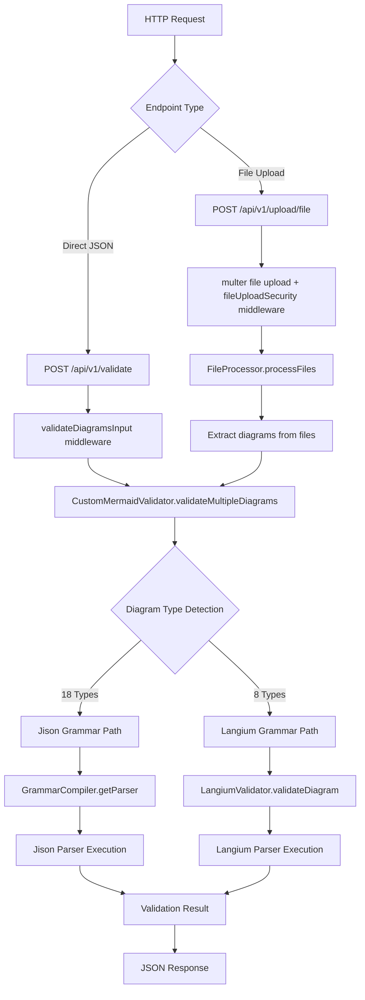

# Mermaid Validator API - Parser Architecture

## Overview

This document describes the complete validation flow from request to parser execution for all 26 supported Mermaid diagram types.

## Architecture Flow



## Parser Organization

### Current Structure
```
src/
├── services/
│   ├── customMermaidValidator.js     # Main validator orchestrator
│   ├── grammarCompiler.js           # Jison parser compiler
│   ├── langiumValidator.js          # Langium parser handler
│   ├── fileProcessor.js             # File extraction service
│   └── language/                    # Langium grammar files
│       ├── pie/pie.langium
│       ├── gitGraph/gitGraph.langium
│       ├── info/info.langium
│       ├── architecture/architecture.langium
│       ├── radar/radar.langium
│       ├── packet/packet.langium
│       ├── treemap/treemap.langium
│       └── common/common.langium
└── routes/
    └── validation.js                # API endpoints
    
src/services/grammars/                    # Jison grammar files
├── flowchart/flow.jison
├── sequence/sequenceDiagram.jison
├── class/classDiagram.jison
├── state/stateDiagram.jison
├── er/erDiagram.jison
├── gantt/gantt.jison
├── user-journey/journey.jison
├── requirement/requirementDiagram.jison
├── sankey/sankey.jison
├── xychart/xychart.jison
├── kanban/kanban.jison
├── quadrant/quadrant.jison
├── c4/c4Diagram.jison
├── mindmap/mindmap.jison
├── timeline/timeline.jison
└── block/block.jison
```

## Validation Flow Details

### 1. Request Processing
- **Direct validation**: `POST /api/v1/validate` with JSON array of diagrams
- **File upload**: `POST /api/v1/upload/file` with markdown/text files
- Security middleware validates content types, file sizes, and request structure

### 2. Diagram Extraction
```javascript
// File upload path
FileProcessor.processFiles(files)
→ Extract content from .md, .txt, .zip files
→ Find ```mermaid code blocks
→ Create diagram objects with metadata

// Direct path
Request body already contains diagram array
```

### 3. Parser Selection & Execution

#### Jison Parsers (18 types)
```javascript
CustomMermaidValidator.validateDiagram()
→ detectDiagramType()
→ GrammarCompiler.getParser(type)
→ parser.parse(diagramContent)
→ Success/Error result
```

**Supported Jison Types:**
- flowchart, sequence, class, state, er, gantt
- user-journey, requirement, sankey, xychart, kanban
- quadrant, c4, mindmap, timeline, block

#### Langium Parsers (8 types)
```javascript
CustomMermaidValidator.validateDiagram()
→ LangiumValidator.validateDiagram()
→ Initialize parser for type
→ parser.parse(diagramContent)
→ Success/Error result
```

**Supported Langium Types:**
- pie, gitGraph, info, architecture, radar, packet, treemap

### 4. Result Aggregation
```javascript
{
  totalDiagrams: number,
  validDiagrams: number,
  invalidDiagrams: number,
  results: [
    {
      diagramId: string,
      valid: boolean,
      errors: [],
      diagramType: string,
      validationMethod: 'custom_grammar_parser'
    }
  ]
}
```

## Most Used Endpoint: File Upload

The file upload endpoint handles:
1. **Multiple file types**: .md, .txt, .zip archives
2. **Batch processing**: Multiple files with multiple diagrams each
3. **Error isolation**: Individual diagram failures don't stop batch processing
4. **Detailed reporting**: Per-file and per-diagram validation results

### Example Usage
```bash
curl -X POST http://localhost:8000/api/v1/upload/file \
  -F 'file=@examples/diagrams/comprehensive_test.md;type=text/markdown' \
  | jq .
```

## Current Status

### Verified Working (18 Jison Parsers)
- All basic syntax validation functional
- Grammar compilation successful
- Parser execution working

### Langium Integration Status
- Grammar files present (8 types)
- LangiumValidator framework ready
- Requires Langium compilation setup for full functionality

## Recommendations

### Architecture Optimization
1. **Keep current structure** - Clean separation between Jison/Langium
2. **Add parser caching** - Compiled parsers should be cached
3. **Improve error reporting** - More specific syntax error messages
4. **Add parser health checks** - Verify all 26 parsers during startup

### Testing Requirements
1. Create comprehensive test suite with all 26 diagram types
2. Test file upload endpoint with mixed diagram types
3. Verify parser selection logic
4. Test error handling for malformed diagrams

### Container Packaging
1. Ensure all grammar files are included in Docker image
2. Pre-compile parsers during build phase
3. Add health endpoint that verifies all parsers
4. Document parser dependencies and versions