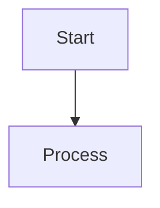

# Simple Flowchart Test

This should work with our current Jison grammar.

Based on the grammar rules:
- `flowchart TD` (FLOWCHART + DIRECTION)
- `A[Start]` (node_definition: NODE + shape)
- `B[Process]` (node_definition: NODE + shape)  
- `A --> B` (connection: NODE + ARROW + NODE)