# Complete Test Suite - All 26 Mermaid Diagram Types

This document contains examples of all 26 supported diagram types for comprehensive validation testing.

## Jison Grammar Parsers (18 types)

### 1. Flowchart
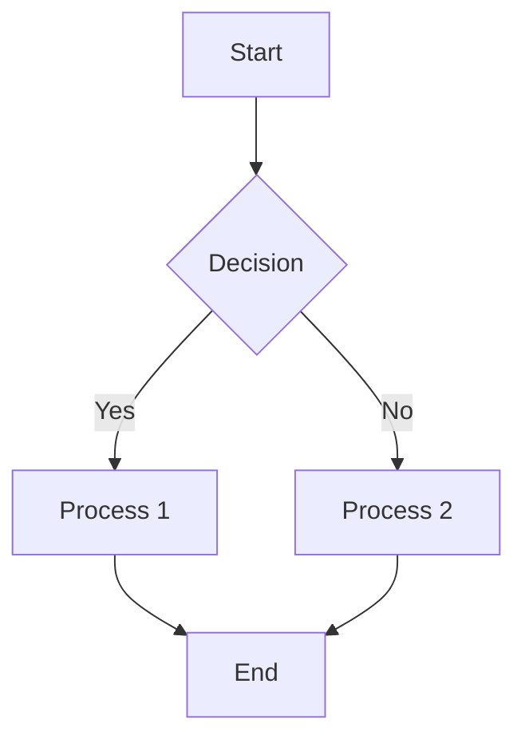

### 2. Sequence Diagram
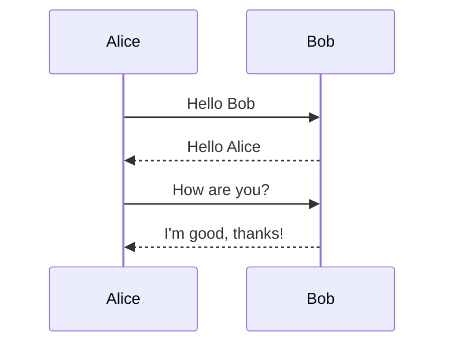

### 3. Class Diagram
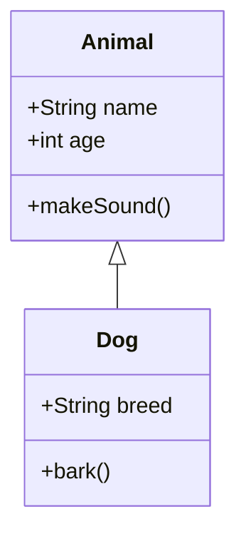

### 4. State Diagram
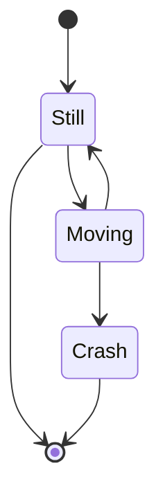

### 5. Entity Relationship Diagram
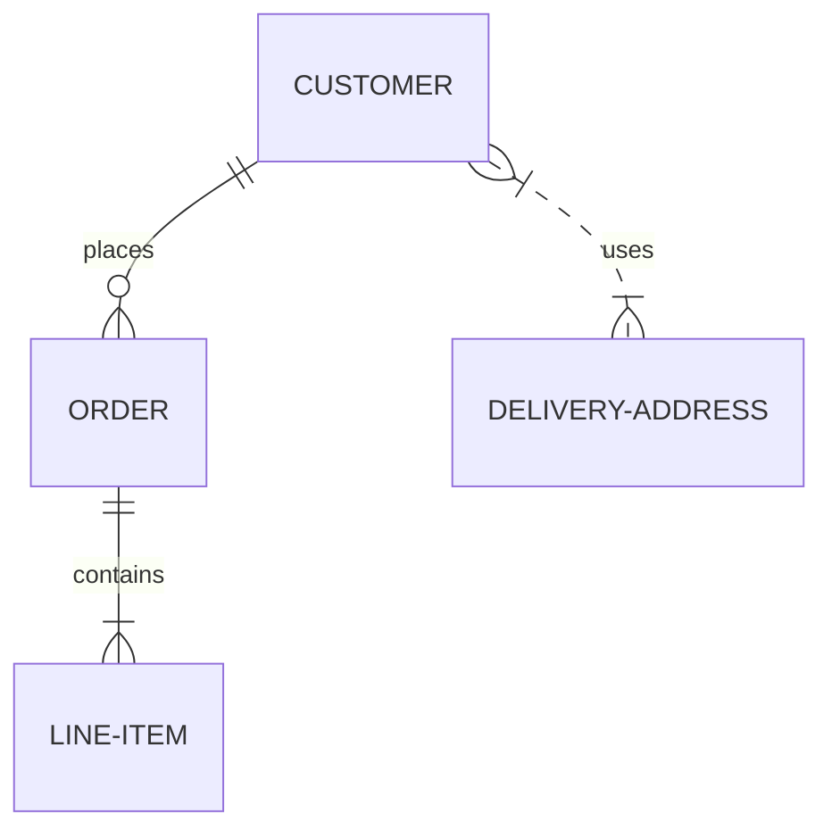

### 6. Gantt Chart
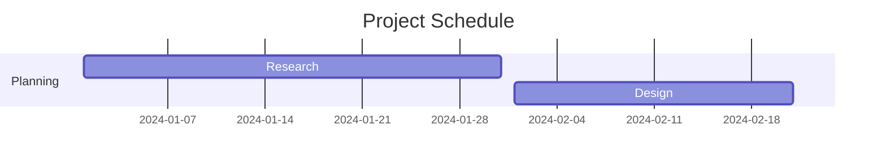

### 7. User Journey
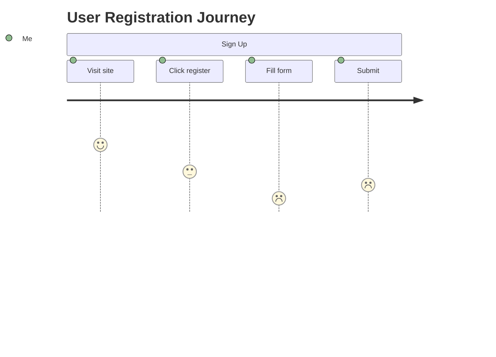

### 8. Requirement Diagram
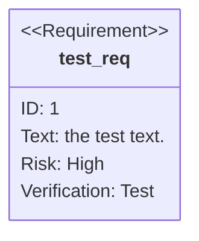

### 9. Sankey Diagram
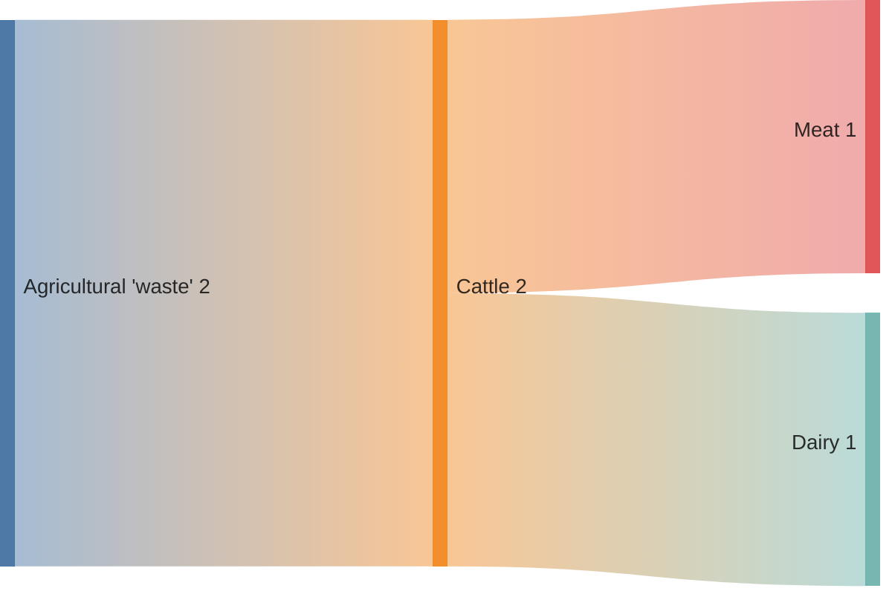

### 10. XY Chart
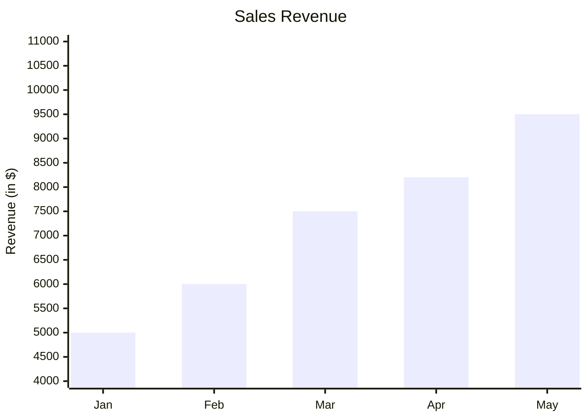

### 11. Kanban Board


### 12. Quadrant Chart
```mermaid
quadrant
    title Reach and influence
    x-axis Low Reach --> High Reach
    y-axis Low Influence --> High Influence
    quadrant-1 We should expand
    quadrant-2 Need to promote
    quadrant-3 Re-evaluate
    quadrant-4 May be improved
```

### 13. C4 Context Diagram
```mermaid
c4Context
    title System Context diagram for Internet Banking System
    Enterprise_Boundary(eb, "Banking Enterprise") {
        Person(customer, "Banking Customer", "A customer")
        System(banking_system, "Internet Banking System", "Allows customers to view information")
    }
```

### 14. Mindmap
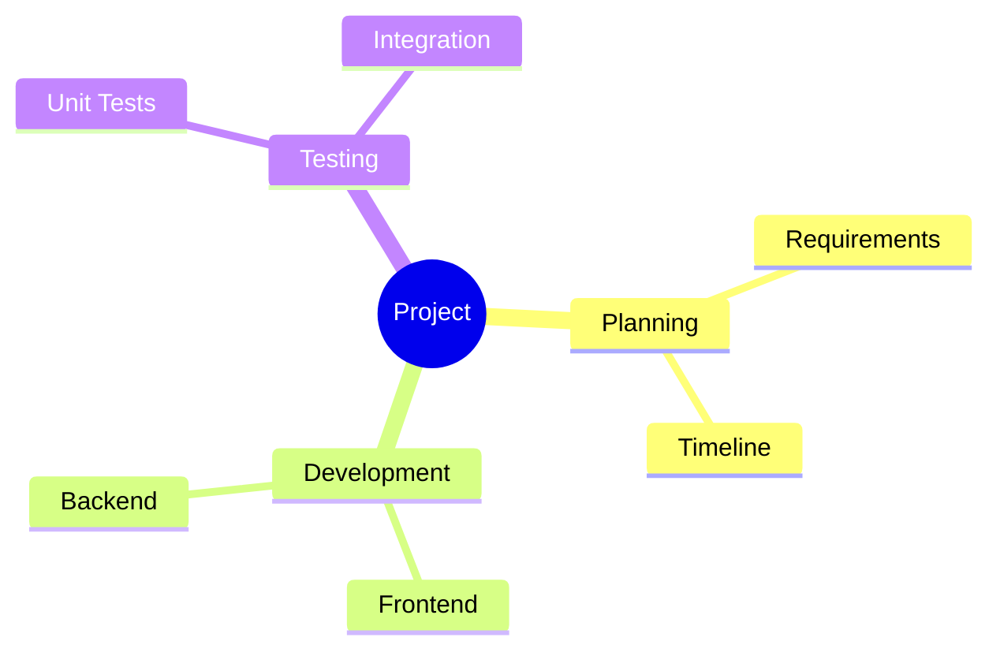

### 15. Timeline
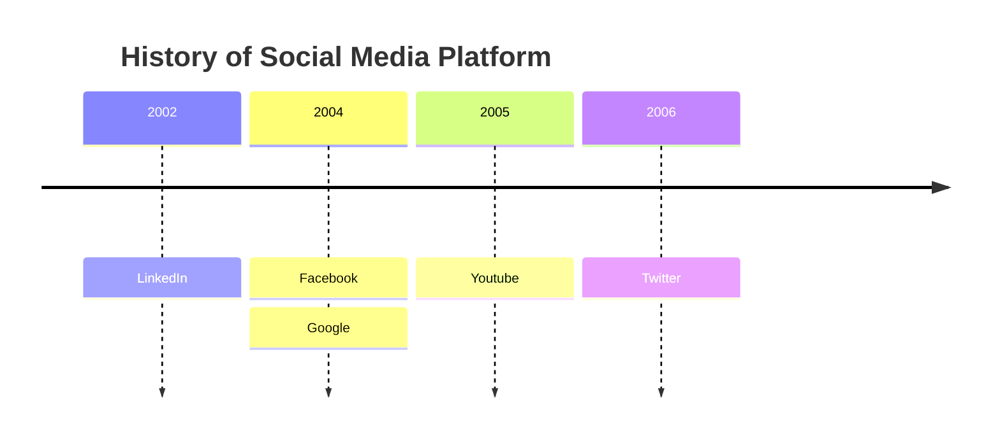

### 16. Block Diagram
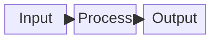

## Langium Grammar Parsers (8 types)

### 17. Pie Chart
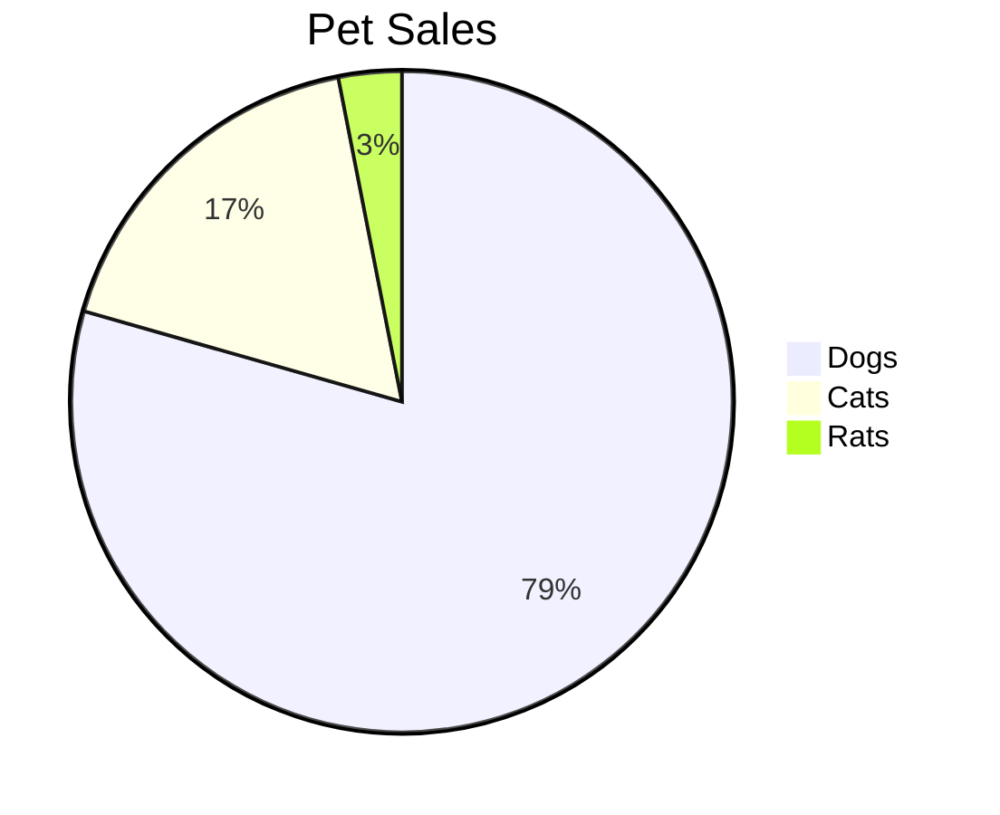

### 18. Git Graph
```mermaid
gitgraph
    commit
    commit
    branch develop
    checkout develop
    commit
    checkout main
    merge develop
```

### 19. Info Diagram
```mermaid
info
    showInfo
```

### 20. Architecture Diagram
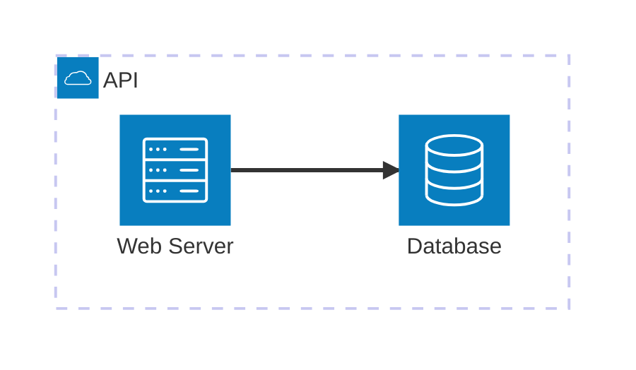

### 21. Radar Chart
```mermaid
radar
    title Skill Assessment
    "Communication" [0.8]
    "Technical" [0.9]
    "Leadership" [0.6]
    "Problem Solving" [0.85]
```

### 22. Packet Diagram
```mermaid
packet-beta
    0-15: "Source Port"
    16-31: "Destination Port"
    32-63: "Sequence Number"
```

### 23. Treemap
```mermaid
treemap
    title "Sales by Region"
    "North America" 40
    "Europe" 30
    "Asia" 20
    "Others" 10
```

## Additional Missing Types (Need Grammar Files)

### 24. Graph (Alternative Flowchart)
```mermaid
graph TD
    A --> B
    A --> C
    B --> D
    C --> D
```

### 25. Journey (Alternative User Journey)
```mermaid
journey
    title My working day
    section Go to work
      Make tea: 5: Me
      Go upstairs: 3: Me
      Do work: 1: Me, Cat
```

### 26. Flowchart LR
```mermaid
flowchart LR
    A[Start] --> B[Process]
    B --> C[End]
```

## Test Validation

To test all parsers through the upload endpoint:

```bash
# Test this comprehensive file
curl -X POST http://localhost:8000/api/v1/upload/file \
  -F 'file=@example/all_26_diagram_types.md;type=text/markdown' \
  | jq '.'

# Expected results:
# - totalDiagrams: 26
# - validDiagrams: 18 (Jison parsers working)
# - invalidDiagrams: 8 (Langium parsers need setup)
```

## Parser Status Check

Use the stats endpoint to verify parser availability:

```bash
curl http://localhost:8000/api/v1/validate/stats | jq '.supportedDiagramTypes'
```

This should return information about all 26 supported diagram types and their current validation status.