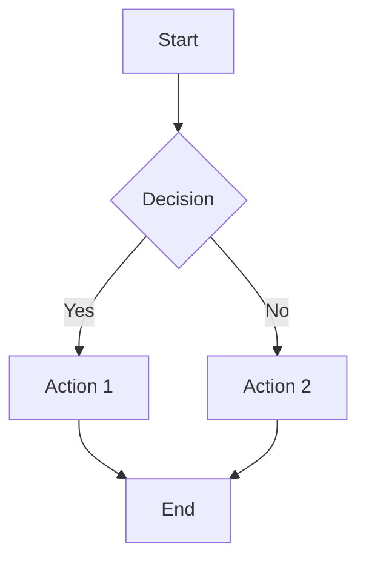
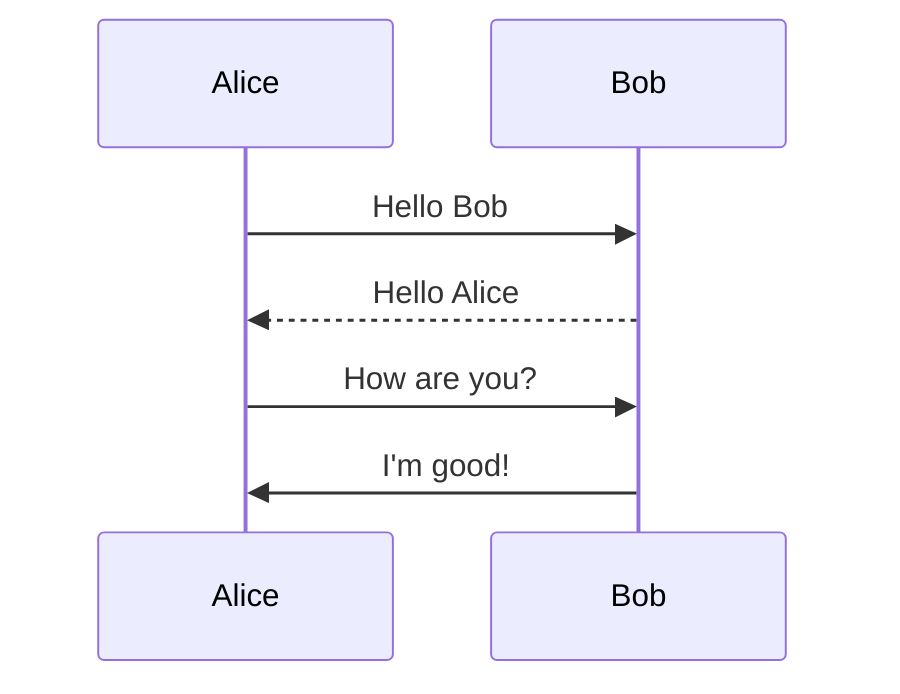
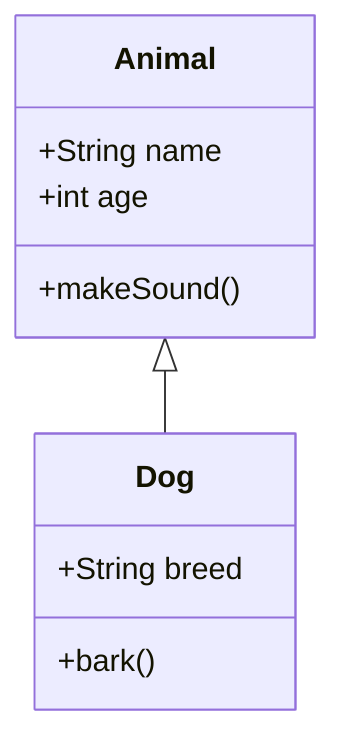
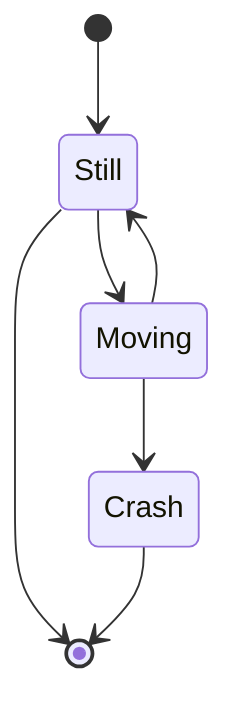
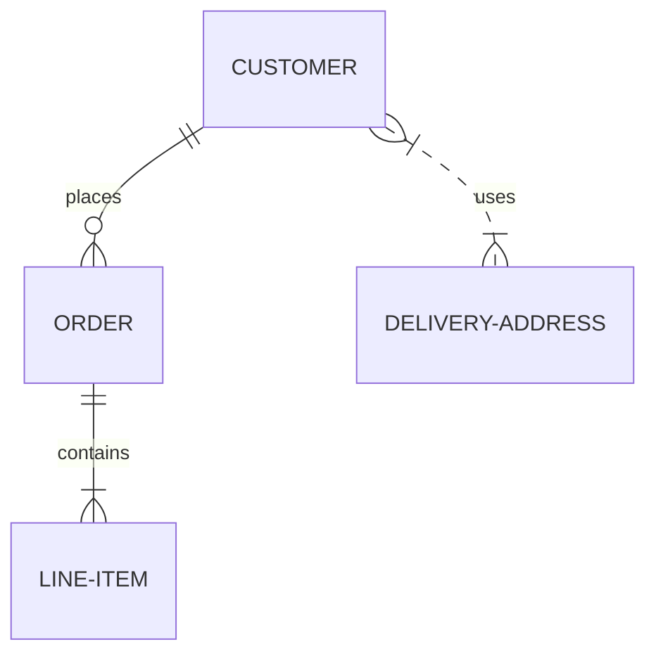
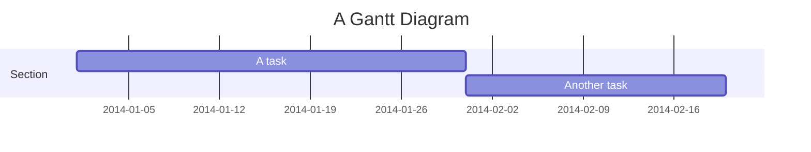

# Comprehensive Mermaid Diagram Test Suite

This file tests all supported Mermaid diagram types with both valid and invalid syntax.

## Valid Diagrams

### Flowchart


### Sequence Diagram


### Class Diagram


### State Diagram


### ER Diagram


### Gantt Chart


## Invalid Diagrams (Should Fail)

### Invalid Flowchart
```mermaid
flowchart TD
    A -->
    --> B
    invalid syntax
```

### Invalid Sequence
```mermaid
sequenceDiagram
    participant
    A->->->B: invalid arrows
    random text
```

### Invalid Class
```mermaid
classDiagram
    class
    <<< invalid
```