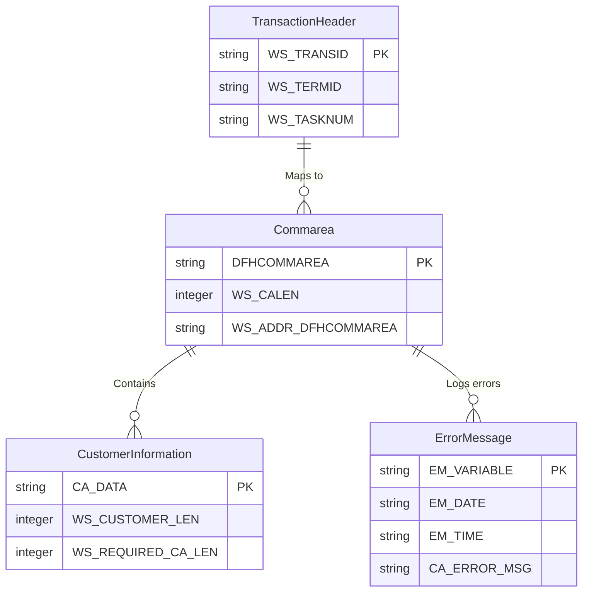

Here's a comprehensive data model document based on the provided COBOL program:

---

### 1. ENTITY-RELATIONSHIP OVERVIEW
#### High-level description of main entities:
- **Transaction Header**: Represents transaction-specific metadata including transaction ID, terminal ID, and task number. Used to manage and track execution contexts.
- **Commarea**: Represents shared memory space used to pass data between linked programs or transactions.
- **Customer Information**: Represents customer-specific data used for business operations.
- **Error Message**: Represents error-related data used for error logging and reporting.

#### Primary data flows and relationships:
- Transaction metadata is initialized during start-up and linked to the **Commarea**.
- The **Commarea**, when available and valid, may pass **Customer Information** between programs (e.g., via LGICDB01).
- Error-related data from the **Commarea** or other operations is structured and sent to external systems (e.g., via program LGSTSQ).

---

### 2. DETAILED ENTITY DESCRIPTIONS

#### Entity: TransactionHeader
- **Business Definition**: Metadata associated with a single transaction, providing context (terminal ID, task number).
- **Attributes**:
  | Attribute Name  | Data Type      | Constraints                | Description                            |
  |-----------------|---------------|----------------------------|----------------------------------------|
  | WS-TRANSID      | String (4)    | Not Null                  | Transaction ID                         |
  | WS-TERMID       | String (4)    | Not Null                  | Terminal ID                            |
  | WS-TASKNUM      | String        | Must be positive integer   | CICS task number for the transaction   |

- **Relationships**:
  - Linked to Commarea through shared memory (ADDRESS OF DFHCOMMAREA).
  - Has functional dependency on initialization routines (INITIALIZE).

- **Business Rules**:
  - WS-TRANSID, WS-TERMID, and WS-TASKNUM are required for transaction processing.
  - WS-TERMID must be unique for concurrent sessions.

---

#### Entity: Commarea
- **Business Definition**: Shared memory space to link data between programs or transactions.
- **Attributes**:
  | Attribute Name     | Data Type    | Constraints           | Description                      |
  |--------------------|-------------|-----------------------|----------------------------------|
  | DFHCOMMAREA        | String      | Max length varies     | Core shared memory area          |
  | WS-CALEN           | Integer     | >= 0                  | Length of Commarea data          |
  | WS-ADDR-DFHCOMMAREA| Address      | Cannot be null        | Memory address of DFHCOMMAREA    |

- **Relationships**:
  - Linked with TransactionHeader for processing addresses and current context.
  - Sends data to external programs (e.g., LGICDB01 or LGSTSQ).

- **Business Rules**:
  - Commarea is required for data sharing, and if length (WS-CALEN) is zero, "NO COMMAREA RECEIVED" error logs.
  - Minimum Commarea length must be validated before further processing.

---

#### Entity: CustomerInformation
- **Business Definition**: Customer-related data used for business logic such as GET-CUSTOMER-INFO.
- **Attributes**:
  | Attribute Name        | Data Type    | Constraints           | Description                    |
  |-----------------------|-------------|-----------------------|--------------------------------|
  | CA-DATA               | String      | Max length of 90      | Customer-related data payload |
  | WS-CUSTOMER-LEN       | Integer     | > 0                   | Length of customer payload     |
  | WS-REQUIRED-CA-LEN    | Integer     | Derived               | Required Commarea length       |

- **Relationships**:
  - Dependent on Commarea for data transmission (via programs LGICDB01).

- **Business Rules**:
  - Customer data transfer is aborted if WS-CUSTOMER-LEN exceeds WS-REQUIRED-CA-LEN.

---

#### Entity: ErrorMessage
- **Business Definition**: Error logs/messages generated during runtime.
- **Attributes**:
  | Attribute Name        | Data Type      | Constraints       | Description                       |
  |-----------------------|----------------|-------------------|-----------------------------------|
  | EM-VARIABLE           | String         | Not Null          | Error description                 |
  | EM-DATE               | MMDDYYYY       | Derived           | Date when error occurred          |
  | EM-TIME               | TIME (HHMM)    | Derived           | Time when error occurred          |
  | CA-ERROR-MSG          | String         | Length depends    | Error-related data payload        |

- **Relationships**:
  - Linked to external program LGSTSQ for logging.
  - May share data with CustomerInformation based on Commarea (CA-DATA).

- **Business Rules**:
  - Errors with no Commarea data log a separate error message "NO COMMAREA RECEIVED."
  - CA-ERROR-MSG contents are shaped based on EIBCALEN length validations.

---

### 3. BUSINESS RULES AND CONSTRAINTS
- **Cross-entity rules**:
  - Commarea data must contain valid CustomerInformation; otherwise, set CA-RETURN-CODE to "98."
- **Integrity Constraints**:
  - Commarea length validation (WS-CALEN >= 0).
  - Linked program calls are conditionally dispatched (LGICDB01 for customers; LGSTSQ for errors).
- **Data Consistency**:
  - Memory address mapping between TransactionHeader and Commarea must remain consistent (ADDRESS OF DFHCOMMAREA).
- **Important Data Quality Rules**:
  - Ensure Commarea accurately maps data between customer payloads and error logic.

---

### 4. DATA MODERNIZATION RECOMMENDATIONS
- **Data Type Improvements**:
  - Replace raw memory mappings (`ADDRESS OF`) with structured JSON or XML representations for modern integrations.
- **Structural Improvements**:
  - Abstract `Commarea` logic into well-defined APIs or objects for modularity.
- **Technical Architecture Enhancements**:
  - Transition error-handling and customer-get routines to web services (e.g., REST APIs).
- **Security Enhancements**:
  - Encrypt sensitive data passed in Commarea during `exec-cics-link()` calls.
- **User Experience Improvements**:
  - Provide clear message outputs for error handling (e.g., user-readable logs instead of raw memory references).

---

### 5. ENTITY-RELATIONSHIP VISUALIZATION (FIXED)

---

### 6. CODE EVIDENCE
- **Entity Representations in Code**:
  - **TransactionHeader**: Located in WS-HEADER section (e.g., Set WS-TRANSID To EIBTRNID).
  - **Commarea**: Frequently referenced through ADDRESS OF DFHCOMMAREA and EIBCALEN checks.
  - **CustomerInformation**: Retrieved from `GET-CUSTOMER-INFO()` subroutine.
  - **ErrorMessage**: Processed by `WRITE-ERROR-MESSAGE()` and transmitted to LGSTSQ.

- **Relationships**:
  - Links between entities implemented with direct references or subroutine calls (`exec-cics-link`).

---

### 7. DATA DEPENDENCIES AND INTEGRATIONS
- **External Data Sources**:
  - DFHCOMMAREA for shared memory.
- **Data Consumers**:
  - LGICDB01 processes customer data; LGSTSQ processes errors.
- **Critical Data Flows**:
  - Transactions rely on valid Commarea mappings for downstream integration.
- **Integration Patterns**:
  - Commarea shared memory adheres to a producer-consumer model between programs.

---

### 8. MISSING INFORMATION
- **Gaps in Data Understanding**:
  - Schema details for customer information (CA-DATA) are missing.
- **Assumptions**:
  - Assumed direct mapping between comm-area attributes and persistent data.
- **Suggested Information Sources**:
  - Review LGICDB01 program for schema definitions and payload formats.