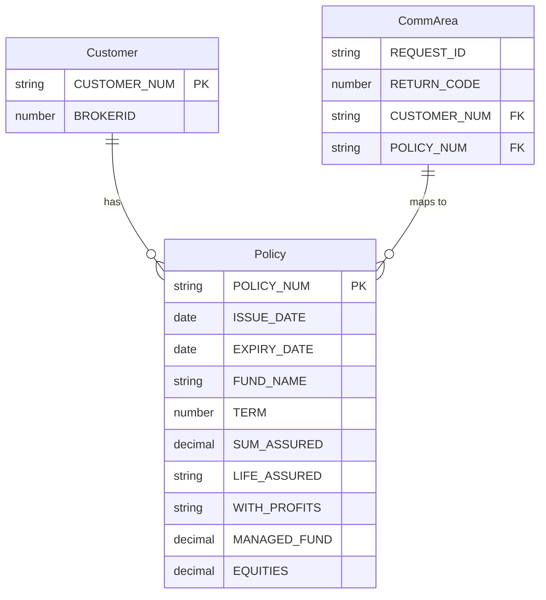

### Comprehensive Data Model Document

---

### **1. ENTITY-RELATIONSHIP OVERVIEW**

**Description of Main Data Entities and Purpose:**

The program `lgtestp2` evolves around insurance policy management for life insurance systems. It deals with operations such as inserting a new life insurance policy, updating an existing one, deleting a policy, or retrieving policy details. Key data entities represent customer information, policy details, and system communication areas for facilitating these operations.

**Primary Data Flows and Relationships:**

1. **Customer Entity** - Stores primary identifiers (`CUSTOMER-NUM`) used in policy operations.
2. **Policy Entity** - Represents life insurance policies containing details like `ISSUE-DATE`, `EXPIRY-DATE`, and various attributes related to fund management.
3. **Comm-Area Entity** - Used for passing data across program components during CICS transactions.
4. **Map Entities** - Input (`SSMAPP2I`) and output (`SSMAPP2O`) maps that facilitate interaction with the user interface.

Relationships primarily tied together via `CUSTOMER-NUM` and `POLICY-NUM`, linking *customers* and *policies*. Comm-area acts as a conduit for enabling communication between external sub-programs for CRUD operations.

---

### **2. DETAILED ENTITY DESCRIPTIONS**

#### **Entity Name:** Customer
**Business Definition:** Represents a life insurance customer identified by a unique `CUSTOMER-NUM`.

- **Attributes:**
  - `CUSTOMER-NUM` (String): Unique identifier for the customer; mandatory.
  - `BROKERID` (Number): Broker ID, defaults to `0`, optional for operations.

- **Relationships:**
  Must have one or more associated policies (`CUSTOMER-NUM` is linked to `POLICY-NUM`).

- **Business Rules:**
  - If `CUSTOMER-NUM` doesn't exist in external systems, operations fail.

---

#### **Entity Name:** Policy
**Business Definition:** Represents insurance policies issued to customers.

- **Attributes:**
  - `POLICY-NUM` (String): Unique identifier for policies; mandatory.
  - `ISSUE-DATE` (Date): Issuance date of the policy; not null.
  - `EXPIRY-DATE` (Date): Expiry date of the policy; nullable until issuance.
  - `FUND-NAME`, `TERM`, `SUM-ASSURED`, `LIFE-ASSURED`, `WITH-PROFITS`, `MANAGED-FUND`, `EQUITIES` (String/Decimal): Various fund-related data for policies.

- **Relationships:**
  Linked to `CUSTOMER-NUM`.

- **Business Rules:**
  - Policies must be associated with valid customers (`CUSTOMER-NUM`).
  - Operations like update/delete cannot proceed if `POLICY-NUM` doesn't exist.
---

#### **Entity Name:** Comm-Area
**Business Definition:** Communication area used for passing operational data across systems and programs.

- **Attributes:**
  - Various worker-level data like `REQUEST-ID`, `RETURN-CODE`, etc.

- **Relationships:**
  Acts as a intermediary between sub-systems.

- **Business Rules:**
  - Communication must succeed for dependent sub-program operations (`exec-cics-link` calls).

---

#### **Entity Name:** Input-Map (SSMAPP2I) / Output-Map (SSMAPP2O)
**Business Definition:** Map entities handling user interactions over terminal sessions.

- **Attributes:**
  - `CUSTOMER-NUM` (String): Customer ID entered by the user.
  - `POLICY-NUM` (String): Policy ID entered or modified.
  - Additional attributes corresponding to policy properties for both inputs and outputs.

- **Relationships:**
  No relational links; standalone entities mapped to others at runtime.

- **Business Rules:**
  - User inputs must be validated for mandatory fields via EIBCALEN > 0.

---

### **3. BUSINESS RULES AND CONSTRAINTS**

- **Cross-Entity Rules:**
  - A valid `CUSTOMER-NUM` and `POLICY-NUM` are required for all operations (Insert, Update, Delete).
  - `COMM-AREA` contents must be consistent with expected formats during `exec-cics-link`.
- **Validation Requirements:**
  - Default values (`Spaces`, `0`, etc.) are used during `INITIALIZE()` operations.
- **Integrity Constraints:**
  - Referential integrity mandates a `CUSTOMER-NUM` must map to at least one policy.

---

### **4. DATA MODERNIZATION RECOMMENDATIONS**

**Data Type Improvements:**
- Use more modern formats for numeric data (e.g., INTEGER, DECIMAL(10(2))) to reflect better precision.

**Structural Improvements:**
- Normalize the entities into external relational tables for direct querying via SQL.

**Security Enhancements:**
- Encrypt sensitive data like `CUSTOMER-NUM` before storing in memory areas like `COMM-AREA`.

**User Experience Improvements:**
- Enhance input validation logic to enforce mandatory fields dynamically, reducing reliance on manual checks (`Please enter valid option`).

---

### **5. ENTITY RELATIONSHIP VISUALIZATION (FIXED)**

---

### **6. CODE EVIDENCE**

#### **Entity: Customer**
- **Location in Code:** Lines 65 (`CUSTOMER-NUM`) processing.
- **Representation:** Commarea fields (`CA-CUSTOMER-NUM`).
- **Relationship Implementation:** Passed into main program via `exec-cics-link`.
- **Confidence:** High.

---

#### **Entity: Policy**
- **Location in Code:** Lines 67 (`POLICY-NUM`, `ISSUE-DATE`, etc.).
- **Representation:** Commarea fields (`CA-*` attributes).
- **Relationship Implementation:** Used as input parameters across CRUD operations like `LGAPOL01`.
- **Confidence:** High.

---

#### **External Integrations:**
- Sub-program calls for database management (`LGIPOL01`, `LGDPOL01`, `LGAPOL01`, `LGUPOL01`).

---

### **Missing Information**

1. **Data Source Details:** No direct database schemas presented, only inferred through comm-area mapping.
2. **Assumptions:** Assumed direct mapping between comm-area attributes and persistent data.
3. **Suggestions:** Study external programs (`LGDPOL01`, etc.) to understand physical data stores.

---
### END